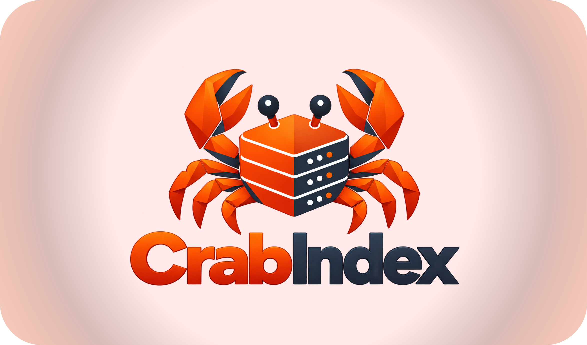

<p align="center">
  
</p>

# CrabIndex

[](https://opensource.org/licenses/MIT)

Агрегатор торрент-трекеров на Rust для [Prisma](https://t.me/prisma_party), Lampa, Sonarr, Radarr и Prowlarr с API в формате Jackett. Хранит данные в файловой БД (FileDB), умеет синхронизироваться с удалённой базой и самостоятельно парсить трекеры по cron. Один статически собранный бинарник `crabindex` + веб-интерфейс в `wwwroot/`.

## Основные возможности

- 🔍 **Агрегация торрентов** с множества трекеров в единый API
- 📺 **Prisma** - основной клиент: подключается как Jackett-источник, поиск по карточке фильма ([инструкция](docs/docs/clients/overview.md#prisma))
- 📦 **Файловая БД (FileDB)** - шардированное хранилище в `Data/fdb` с `masterDb` и кешем в памяти
- 🔄 **Синхронизация** с удалённым сервером (`syncapi`) или самостоятельный парсинг
- 🎯 **API Jackett** - совместимый формат выдачи
- 📡 **Torznab XML** - встроенный Torznab API для Sonarr / Radarr / Prowlarr
- 🌐 **Веб-интерфейс** - поиск, статистика, фоновые задачи и редактор конфигурации
- ⚙️ **Админ-панель** - настройки (форма, YAML/JSON, валидация, diff, горячая перезагрузка), задачи, логи и обслуживание по закрытому адресу `{admin.path}?{admin.token}` с паролем `devkey`
- 🛡️ **WAF** - встроенный фильтр запросов: статистика кто и куда ходит, чёрные и белые списки IP и доменов, баны, лимит запросов, ловушки для сканеров, блокировка ботов по категориям ([подробнее](#waf-защита-от-лишней-нагрузки))
- ☁️ **FlareSolverr в админке** - статистика ошибок обхода Cloudflare по трекерам, подсказки по лимитам, закрытие сессий браузера и пауза в один клик
- ⬆️ **Обновление из админки** - проверка новой версии на GitHub и обновление в один клик с проверкой SHA256
- 📚 **Документация** - встроена в сервер: `http://<хост>:9117/docs/` (исходники в [`docs/`](docs/), Docusaurus)
- 📖 **OpenAPI / Swagger** - `/openapi.yaml`, `/swagger/v1/swagger.json`, интерактивная документация на `/swagger`
- 🗂️ **25 трекеров** - парсинг и sync
- 🔐 **Прокси** (HTTP/SOCKS, Tor для .onion), FlareSolverr + cffetch для хостов за Cloudflare
- 📊 **Статистика** по трекерам и торрентам
- 🎵 **Модуль tracks** - сбор метаданных аудио/видео дорожек через TorrServer / ffprobe (опционально)
- 🦀 **Rust / tokio / axum** - асинхронный сервер, низкое потребление памяти, быстрый старт
- 🐳 **Docker** - готовый `Dockerfile` и пример `docker-compose`

---

## Требования

- Готовые сборки: **Linux** x86_64 / arm64 (статические, musl), **macOS** Apple Silicon / Intel, **Windows** x64 и Docker-образ (amd64 + arm64) - см. [релизы](https://github.com/sheinices/crabindex/releases/latest)
- Для продакшена рекомендуется Linux (systemd, cron); для полной базы - 10+ ГБ на диске
- Для обхода Cloudflare (FlareSolverr) - от 2 ядер и 4 ГБ памяти, см. [требования](docs/docs/configuration/flaresolverr.md)
- Сборка из исходников: **Rust** stable ([rustup](https://rustup.rs)) и **Node.js 22+** для веб-интерфейса

Внешних системных библиотек не требуется: TLS реализован на rustls.

---

## Установка

Пошаговая инструкция для всех платформ - [docs/docs/installation.md](docs/docs/installation.md) (она же встроена в сервер: `http://<хост>:9117/docs/`).

После установки на любой платформе:

- сайт (поиск) - **`http://<хост>:9117/`**, проверка - `/health` → `{"status":"OK"}`;
- [админ-панель](docs/docs/admin.md) - адрес `{admin.path}?{admin.token}` и пароль `devkey` выводятся при первом запуске, повторно - `crabindex admin`;
- конфигурация - `init.yaml` в рабочем каталоге (в Docker - `/app/config/init.yaml`); база наполняется синхронизацией (`syncapi`, уже задан в шаблоне) или парсингом по cron.

### Linux-сервер (установщик, systemd)

1. Запустите установщик на сервере (Debian, Ubuntu, RHEL, Fedora, Arch и другие с systemd). Он поставит недостающие пакеты, скачает сборку под архитектуру сервера и установит её в `/opt/crabindex`:

   ```bash
   # с вопросами: путь админ-панели, ставить ли FlareSolverr
   curl -fsSL https://raw.githubusercontent.com/sheinices/crabindex/main/scripts/install.sh | sudo bash

   # сразу с обходом Cloudflare (FlareSolverr + cffetch в Docker, лимиты по ресурсам сервера)
   curl -fsSL https://raw.githubusercontent.com/sheinices/crabindex/main/scripts/install.sh | sudo bash -s -- --flaresolverr

   # без FlareSolverr и без вопросов
   curl -fsSL https://raw.githubusercontent.com/sheinices/crabindex/main/scripts/install.sh | sudo bash -s -- --no-flaresolverr --yes
   ```

2. Выберите язык установщика (русский или английский; сразу - `--lang ru|en`), путь админ-панели (`/admin` или свой) и источник базы: синхронизация с `sync.crab.rip` (рекомендуется, `--db sync`) или собственный парсинг трекеров (`--db parse`, FlareSolverr предлагается только в этом режиме). Если порт 9117 занят, установщик предложит ближайший свободный; свой порт - `--port 9120`.
3. Сохраните адрес админ-панели, пароль (`devkey`) и порт из итогового сообщения. Повторно: `cd /opt/crabindex && sudo -u crabindex ./crabindex admin`.
4. Проверьте: `systemctl status crabindex`, `curl http://127.0.0.1:9117/health`.

Конфиг - `/opt/crabindex/init.yaml`, данные - `/opt/crabindex/Data/`. Обновление - `... | sudo bash -s -- --update`, удаление - `--uninstall [--purge]`, проверка системы - `--check`, все параметры - `--help`. Ручная установка со своим unit-файлом - в [документации](docs/docs/installation.md) и на странице [Linux](docs/docs/deployment/linux.md).

### Docker / Docker Compose

1. Запустите готовый образ:

   ```bash
   docker run -d --name crabindex --restart unless-stopped -p 9117:9117 \
     -v crabindex-config:/app/config -v crabindex-data:/app/Data \
     ghcr.io/sheinices/crabindex:latest
   ```

   Или стек с FlareSolverr, WARP и cffetch для трекеров за Cloudflare на основе [docker-compose.example.yml](docker-compose.example.yml):

   ```bash
   git clone https://github.com/sheinices/crabindex.git && cd crabindex
   cp docker-compose.example.yml docker-compose.yml
   docker compose up -d
   ```

2. Возьмите адрес админ-панели и `devkey` из лога: `docker logs crabindex 2>&1 | grep admin:` (путь панели при первом запуске - переменная `CRABINDEX_ADMIN_PATH`).
3. Откройте `http://<хост>:9117/`. Конфиг - `/app/config/init.yaml` в томе.

Конфиг при старте контейнера выбирается так: `/app/config/init.yaml` → `/app/config/init.conf` → `/app/Data/init.*` → шаблон по умолчанию (`Data/example.yaml`). Cron-задачи запускаются снаружи контейнера (`Data/crontab`, `Data/run-job.sh`). Подробнее - [Docker](docs/docs/deployment/docker.md).

### macOS

1. Скачайте [`crabindex-macos-arm64.tar.gz`](https://github.com/sheinices/crabindex/releases/latest/download/crabindex-macos-arm64.tar.gz) (Apple Silicon) или [`crabindex-macos-x86_64.tar.gz`](https://github.com/sheinices/crabindex/releases/latest/download/crabindex-macos-x86_64.tar.gz) (Intel).
2. Распакуйте и подготовьте конфиг:

   ```bash
   tar -xzf crabindex-macos-arm64.tar.gz
   mv crabindex-*-macos-arm64 ~/crabindex && cd ~/crabindex
   xattr -d com.apple.quarantine ./crabindex   # если скачано браузером: снять карантин Gatekeeper
   cp Data/example.yaml init.yaml
   ```

3. Запустите `./crabindex` (из этого каталога). Адрес админ-панели и `devkey` появятся в консоли, повторно - `./crabindex admin`.
4. Откройте `http://127.0.0.1:9117/`. Конфиг - `~/crabindex/init.yaml`. Автозапуск через launchd - [Windows и macOS](docs/docs/deployment/windows.md).

### Windows

1. Скачайте [`crabindex-windows-x86_64.zip`](https://github.com/sheinices/crabindex/releases/latest/download/crabindex-windows-x86_64.zip) и распакуйте, например, в `C:\crabindex` (чтобы `crabindex.exe`, `wwwroot\` и `Data\` лежали прямо в нём).
2. В PowerShell:

   ```powershell
   cd C:\crabindex
   Copy-Item Data\example.yaml init.yaml
   .\crabindex.exe
   ```

3. Адрес админ-панели и `devkey` появятся в консоли, повторно - `.\crabindex.exe admin`. Откройте `http://127.0.0.1:9117/`. Конфиг - `C:\crabindex\init.yaml`.
4. Останавливайте сервер через Ctrl+C (так сохраняется база). Запуск как службы (NSSM) и Планировщик заданий вместо cron - [Windows и macOS](docs/docs/deployment/windows.md).

### Из исходников

```bash
git clone https://github.com/sheinices/crabindex.git && cd crabindex
make web        # Vue SPA → wwwroot/
make release    # target/release/crabindex
cp Data/example.yaml init.yaml   # отредактируйте под себя
./target/release/crabindex
```

Или сразу собрать и установить как службу: `sudo scripts/install.sh` (из клона; Rust и Node.js установщик поставит сам). Подробнее - [Сборка](docs/docs/development/building.md).

Приложение работает относительно текущего каталога: читает `init.yaml` (или `init.conf`), хранит базу в `Data/`, отдаёт статику из `wwwroot/`. При остановке (SIGTERM / Ctrl+C) сервер завершает фоновые задачи и сбрасывает на диск кеш FileDB и `masterDb`.

Цели `make`:

| Цель | Описание |
| --- | --- |
| `make build` | Debug-сборка |
| `make release` | Release-бинарник (`TARGET=` для кросс-сборки) |
| `make test` | Все тесты workspace |
| `make web` | Сборка веб-интерфейса в `wwwroot/` |
| `make dist` | Готовый бандл в `dist/`: бинарник, `wwwroot/`, шаблоны `Data/`, установщик |
| `make docker` | Docker-образ `crabindex` |

Версия, git SHA, ветка и дата сборки вшиваются в бинарник при компиляции (`build.rs`) и печатаются при старте. Без `.git` их можно задать переменными `CRABINDEX_VERSION`, `CRABINDEX_GIT_SHA`, `CRABINDEX_GIT_BRANCH`, `CRABINDEX_BUILD_DATE`.

---

## Конфигурация

Файл `init.yaml` (приоритетнее) или `init.conf` (JSON) в рабочем каталоге. Полный пример с комментариями - [Data/example.yaml](Data/example.yaml). Указываются только отличающиеся от умолчаний ключи; изменения файла подхватываются автоматически (проверка раз в 10 секунд).

Основное:

| Ключ | Описание |
| --- | --- |
| `listenip`, `listenport` | Адрес и порт (`any` = все интерфейсы, по умолчанию `9117`) |
| `apikey` | Ключ для поисковых API (пусто - без проверки) |
| `devkey` | Пароль админ-панели; ключ для `/dev/`, `/cron/`, `/jsondb` из интернета (генерируется при первом запуске) |
| `admin` | Админ-панель: `enable`, `path` (по умолчанию `/admin`), `token` (генерируется), `sessionHours` |
| `web` | Раздавать веб-интерфейс из `wwwroot/` |
| `syncapi`, `synctrackers` | Синхронизация с удалённым сервером |
| `disable_trackers` | Трекеры, отключённые на этом инстансе |
| `evercache`, `fdbPathLevels` | Кеш и структура FileDB |
| `logging` | Уровни логов по категориям (`tracks`, `sync`, `cron`, `fdb`, `parsers`…) |
| `flaresolverr`, `cffetch`, `proxy`, `globalproxy` | Сеть и обход Cloudflare |
| `search`, `torznab`, `alloha` | Поиск и Torznab |

Настройки можно менять в админ-панели - сохранение атомарное, с валидацией и просмотром diff.

---

## Доступ и безопасность

| Пути | Политика |
| --- | --- |
| `/`, `/stats`, `/health`, `/version`, `/lastupdatedb`, `/api/v1.0/conf`, `/sync/*`, статика, `/swagger`, `/openapi.yaml` | Публично |
| Поиск: `/api/v1.0/torrents`, `/api/v2.0/indexers/*`, `/torznab/api`, `/stats/*` … | `apikey`, если задан |
| `/dev/*`, `/cron/*`, `/jsondb*` | Локальная сеть или `devkey` |
| `{admin.path}/*` (админ-панель и её API) | Токен входа (`{admin.path}?{token}`) + вход по `devkey`; без них - обычный 404 |

- `apikey` передаётся как `?apikey=`, заголовок `X-Api-Key` или `Authorization: Bearer …`.
- `devkey` - заголовок `X-Dev-Key` или `?devkey=`.
- «Локальная сеть» - прямое подключение с loopback / RFC1918 / IPv6 ULA и link-local. Запросы через обратный прокси (заголовки `X-Forwarded-*`, `Forwarded`, `CF-Connecting-IP`, `X-Real-IP`) считаются внешними и требуют `devkey`.
- `X-Forwarded-For` / `X-Forwarded-Proto` учитываются только если прокси работает на том же хосте (loopback).
- Маршрутизация нечувствительна к регистру пути и имён query-параметров.

---

## WAF: защита от лишней нагрузки

CrabIndex часто работает публично (например, как сервер синхронизации для других установок), поэтому в него встроен WAF - фильтр, который видит каждый HTTP-запрос. Он показывает, кто и куда ходит, и отсекает сканеры, ботов и слишком активных клиентов раньше, чем запрос дойдёт до базы. Внешний WAF для этого не нужен, всё управляется из админ-панели, раздел **WAF**.

### Что умеет

| Функция | Как работает |
| --- | --- |
| Статистика и журнал | Каждый запрос: время, IP, метод, путь, код ответа, время ответа, User-Agent, домен запроса (Host), сайт-источник (Origin), причина блокировки. Графики запросов и блокировок, топ IP, путей, доменов |
| Чёрный и белый списки IP | Адреса и подсети IPv4 / IPv6 (CIDR), с комментарием и сроком. Белый список освобождает от лимитов, банов и фильтров |
| Лимит запросов | Больше `perMinute` запросов в минуту с одного IP - ответ `429` и автоматический бан |
| Ловушки | Обращение к приманкам для сканеров (`/.env`, `/wp-admin`, `/.git/` …) - `404` и бан на сутки |
| Фильтр User-Agent | Свои регулярные выражения (`blockUserAgents`) - `403` и бан |
| Баны | Автоматические (за лимит, ловушку, User-Agent) и ручные, истекают сами |
| Блокировка доменов | Запросы со сторонних сайтов (заголовки `Origin` / `Referer`): встроенный список из 18 доменов, который нельзя изменить из панели, плюс свои чёрный и белый списки и режим «только разрешённые домены» |
| Боты | Распознавание по User-Agent, статистика по каждому боту, блокировка целых категорий или отдельных ботов, `robots.txt` с запретом индексации |

### Боты

Раздел **WAF → Боты** показывает всех замеченных ботов: сколько запросов, сколько заблокировано, с какого числа IP, куда ходят и когда были последний раз. Встроенный каталог разбит на категории:

| Категория | Примеры |
| --- | --- |
| Поисковики | Googlebot, YandexBot, bingbot, Baiduspider, Applebot |
| ИИ-краулеры | GPTBot, ClaudeBot, CCBot, Bytespider, PerplexityBot, Amazonbot |
| SEO-боты | AhrefsBot, SemrushBot, MJ12bot, DotBot, DataForSeoBot |
| Превью соцсетей | TelegramBot, facebookexternalhit, Twitterbot, Discordbot |
| Мониторинг | UptimeRobot, Pingdom, StatusCake, Better Uptime |
| Сканеры | zgrab, masscan, Nmap, nuclei, sqlmap, Censys |
| HTTP-библиотеки | curl, Wget, python-requests, Go-http-client, okhttp |
| Пустой User-Agent | Запросы без User-Agent |
| Прочие боты | Всё, что называет себя bot, crawler или spider |

Блокировать можно целую категорию одним переключателем, отдельного бота из таблицы или по своей подстроке User-Agent. Белый список ботов важнее блокировок. Заблокированный бот получает `403`, его IP не банится: с одного адреса могут ходить и бот, и обычные клиенты. Переключатель **robots.txt** отдаёт `Disallow: /`, и вежливые краулеры сами перестают ходить.

По умолчанию не блокируется ничего. Клиенты синхронизации CrabIndex, Jackett, Prowlarr и Prisma в каталог ботов не входят. Категории «HTTP-библиотеки» и «Пустой User-Agent» могут задеть ваши скрипты, панель предупреждает об этом перед включением.

### Порядок проверки

1. Localhost пропускается всегда (от него работает cron).
2. Встроенный список доменов - `403` для всех, кроме localhost.
3. Локальная сеть (`whitelistLan`) и белый список IP - пропустить.
4. Чёрный список IP и активные баны - `403`.
5. Чёрный список доменов и режим «только разрешённые домены» - `403`.
6. Белый список доменов - дальнейшие проверки не выполняются.
7. Правила ботов - `403` без бана.
8. Фильтр User-Agent - `403` и бан.
9. Ловушки - `404` и бан.
10. Лимит запросов - `429` и бан.

### Настройка

Параметры - секция `waf` в `init.yaml` (или **Настройки → WAF** в панели):

```yaml
waf:
  enable: true               # false - ничего не блокировать, статистика собирается
  logRequests: true          # журнал и статистика в памяти
  rateLimit:
    enable: true
    perMinute: 300           # запросов с одного IP за минуту
    banMinutes: 15
  trapPaths: [/.env, /wp-admin, /wp-login.php, /.git/, /phpmyadmin]
  trapBanMinutes: 1440
  blockUserAgents: []        # свои регулярные выражения
  whitelistLan: true
  domainAllowlistOnly: false
```

Списки IP и доменов, баны и правила ботов хранятся в `Data/waf.json` и переживают перезапуск; правка из панели не переписывает `init.yaml`. Статистика и журнал живут в памяти и обнуляются при перезапуске.

За обратным прокси (nginx, Cloudflare) реальный IP клиента берётся из `X-Forwarded-For` / `CF-Connecting-IP`, только если прокси работает на том же сервере. Панель не даст заблокировать собственный IP, а с самого сервера CrabIndex доступен всегда. WAF защищает на уровне приложения; от объёмных DDoS-атак нужен внешний фильтр (Cloudflare, провайдер).

Подробно: [docs/docs/operations/waf.md](docs/docs/operations/waf.md).

## Обслуживание FileDB

```bash
./crabindex maintain --mode=report   # отчёт о целостности
./crabindex maintain --mode=safe     # безопасные исправления
./crabindex maintain --mode=full     # полное обслуживание
```

Те же операции доступны по HTTP: `/cron/maintenance/Check?mode=report|safe|full`.

---

## Структура проекта

| Крейт | Назначение |
| --- | --- |
| `crates/crabindex` | Бинарник: HTTP-сервер, безопасность, конфиг API, health, Swagger, фоновые задачи |
| `crates/crab-core` | Модели, конфигурация, FileDB, HTTP-клиент, парсинг, логирование |
| `crates/crab-cloudflare` | FlareSolverr / cffetch, прогрев Cloudflare-сессий |
| `crates/crab-trackers-*` | Парсеры трекеров |
| `crates/crab-search` | Поиск, Jackett / Torznab / torrents API |
| `crates/crab-tracks` | Модуль tracks и статистика |
| `crates/crab-ops` | Sync, cron трекеров, обслуживание БД, `maintain` |
| `web/` | Веб-интерфейс (Vue + Vite), `web/public/openapi.yaml` - контракт API |

---

## Лицензия

MIT License. См. файл [LICENSE](LICENSE).

## Релизы

Сборки под все платформы делает GitHub Actions (`.github/workflows/release.yml`). Чтобы выпустить версию, создайте релиз на GitHub с тегом вида `v1.0.0` («Create a new release» → «Publish release»). Через несколько минут к релизу прикрепятся:

- `crabindex-linux-x86_64.tar.gz`, `crabindex-linux-arm64.tar.gz` - статические сборки (musl) с установщиком;
- `crabindex-macos-arm64.tar.gz`, `crabindex-macos-x86_64.tar.gz`, `crabindex-windows-x86_64.zip`;
- `SHA256SUMS`;
- Docker-образ `ghcr.io/sheinices/crabindex:<версия>` и `:latest` (amd64 + arm64).

Версия в сборке, `/version` и Swagger берётся из тега.
