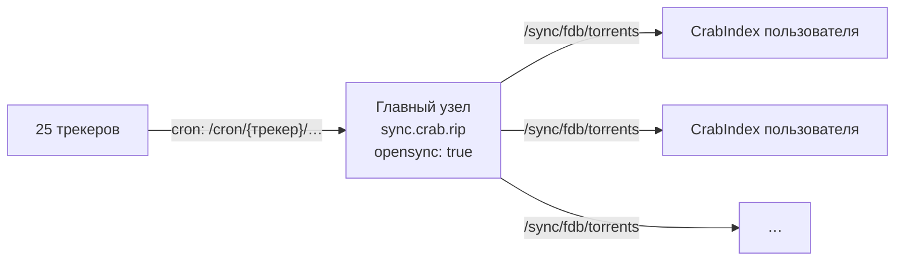

# Свой сервер синхронизации

Сервер синхронизации - это обычный экземпляр CrabIndex, который сам парсит все трекеры и отдаёт свою базу другим по [Sync API](../api-reference/sync.md). Отдельного продукта или отдельной базы для этого не нужно: любой CrabIndex с `opensync: true` уже умеет раздавать FileDB. Пользователи прописывают его адрес в `syncapi` и получают готовую базу без собственного парсинга.

На этой странице - как поднять такой «главный узел» на домене `sync.crab.rip`.



## Что понадобится

| Ресурс | Рекомендация |
| --- | --- |
| Сервер | Linux, работает круглосуточно. 2 vCPU, 4 ГБ RAM (плюс ~1-1,5 ГБ на каждый браузер FlareSolverr) |
| Диск | 20+ ГБ SSD: полная база - около 3 млн раздач и несколько ГБ в `Data/fdb`, плюс логи и резервные копии `masterDb` |
| Сеть | Стабильный канал. Трекеры за Cloudflare лучше ходят через WARP или резидентный прокси, чем с IP дата-центра |
| Учётные записи | Логины или cookie для трекеров с авторизацией: Kinozal, Toloka, Mazepa, Korsars, AniFilm, LostFilm, AnimeLayer, Selezen, RuDub, BaibaKo |
| Сопутствующие сервисы | FlareSolverr и cffetch - для Rutracker, Kinozal, Anibelka и других хостов за Cloudflare. См. [FlareSolverr и cffetch](../configuration/flaresolverr.md) |

## 1. Установите CrabIndex

Любым способом из раздела [Установка](../installation.md) или [Docker](docker.md). Дальше пример для установки в `/opt/crabindex` с systemd.

## 2. Конфигурация главного узла

```yaml
# /opt/crabindex/init.yaml
listenip: 127.0.0.1          # наружу - только через обратный прокси
listenport: 9117
apikey: ""                   # пусто: поиск на главном узле открыт (или задайте ключ)
devkey: "длинный-случайный-ключ"   # пароль админ-панели; закрывает /cron, /dev, /jsondb (генерируется при первом запуске)

opensync: true               # отдавать базу по /sync/*
# syncapi не задан: главный узел ни у кого не синхронизируется, а парсит сам

logFdb: false                # журнал изменений FileDB на главном узле растёт очень быстро
logParsers: true

evercache:
  enable: true               # кеш шардов в памяти ускоряет отдачу /sync
  validHour: 1
  maxOpenWriteTask: 2000
  dropCacheTake: 200

flaresolverr:
  enable: true
  url: http://127.0.0.1:8191/v1
  crawlUrl: http://127.0.0.1:8193/v1   # отдельный браузер для полных обходов
cffetch:
  enable: true
  url: http://127.0.0.1:8192/fetch

# учётные данные трекеров - только для тех, где нужна авторизация
Kinozal:
  login: { u: "…", p: "…" }
Toloka:
  login: { u: "…", p: "…" }
# …остальные - см. страницы трекеров
```

Все ключи - в [Обзоре конфигурации](../configuration/overview.md), настройки конкретного трекера - на его странице в разделе [Трекеры](../trackers/overview.mdx).

:::warning[Внимание]
На главном узле не задавайте `synctrackers`, `disable_trackers` и `syncsport: false`: всё, что отфильтровано на главном узле, пользователи не получат совсем.
:::

## 3. Включите парсинг всех трекеров

Главный узел наполняет базу сам - по расписанию из `Data/crontab`:

```bash
sudo crontab -u crabindex /opt/crabindex/Data/crontab
```

Если cron обращается к серверу через прокси, допишите `?devkey=…` к URL в crontab или вызывайте cron с того же хоста напрямую на `127.0.0.1:9117` - запросы с loopback без обратного прокси считаются локальными. Подробности и расписание - в разделе [Cron](cron.md).

Раз в сутки запускается `UpdateTasksParse` (карта страниц каждого трекера), затем `ParseAllTask` постепенно обходит все страницы, а `parse` каждый час забирает новые раздачи. Ход полных обходов видно в разделе **Задачи** [админ-панели](../admin.md) и в `GET /cron/maintenance/ParseAllStatus`.

## 4. Первичное наполнение базы

Полный обход с нуля идёт долго: у Rutracker около 16 тыс. страниц при ограничении частоты запросов, так что первый цикл займёт недели. Есть два пути.

### Вариант А. Своими парсерами

Ничего дополнительно делать не нужно - просто дождитесь, пока `ParseAllTask` пройдёт полный цикл по каждому трекеру. Самый независимый путь, но база будет неполной, пока цикл не завершится.

### Вариант Б. Забрать готовую базу у другого сервера, затем парсить самому

Протокол синхронизации совместим с другими серверами того же формата, поэтому базу можно один раз скачать с уже наполненного сервера:

1. Временно укажите его в конфиге главного узла:

   ```yaml
   syncapi: https://адрес-наполненного-сервера
   syncspidr: false
   timeSync: 20
   ```

2. Дождитесь окончания первой загрузки. В логе категории `sync` появится `end`, а в `Data/temp/` - `starsync.txt`. Для полной базы это несколько часов.
3. Уберите `syncapi` из конфига. Сервер перечитает его в течение 10 секунд, дальше база ведётся вашими парсерами.

:::note[Примечание]
Серверы за Cloudflare иногда блокируют запросы с IP дата-центров (ответ `403` со страницей «Sorry, you have been blocked»). Такой ответ не обходится через FlareSolverr - нужен другой исходящий IP.
:::

## 5. Домен и обратный прокси

DNS: запись `A` (и `AAAA`) для `sync.crab.rip` на IP сервера.

Наружу достаточно открыть только `/sync/*` (и, по желанию, поиск и веб-интерфейс). Служебные маршруты лучше закрыть на уровне прокси, даже при заданном `devkey`. Config API снаружи не доступен в любом случае, а [админ-панель](../admin.md) без токена отвечает `404`; при желании закройте и её путь:

```nginx
limit_req_zone $binary_remote_addr zone=crab_sync:10m rate=5r/s;

server {
    listen 443 ssl http2;
    server_name sync.crab.rip;

    ssl_certificate     /etc/letsencrypt/live/sync.crab.rip/fullchain.pem;
    ssl_certificate_key /etc/letsencrypt/live/sync.crab.rip/privkey.pem;

    # служебные маршруты - только изнутри
    location ~* ^/(cron|dev|jsondb)(/|$) { return 403; }
    # location ^~ /my-panel { allow 203.0.113.0/24; deny all; proxy_pass http://127.0.0.1:9117; }

    location /sync/ {
        limit_req zone=crab_sync burst=20 nodelay;
        proxy_pass http://127.0.0.1:9117;
        proxy_http_version 1.1;
        proxy_set_header Host $host;
        proxy_set_header X-Forwarded-For $proxy_add_x_forwarded_for;
        proxy_set_header X-Forwarded-Proto $scheme;
        proxy_read_timeout 120s;
        gzip on;
        gzip_types application/json;
    }

    location / {
        proxy_pass http://127.0.0.1:9117;
        proxy_http_version 1.1;
        proxy_set_header Host $host;
        proxy_set_header X-Forwarded-For $proxy_add_x_forwarded_for;
        proxy_set_header X-Forwarded-Proto $scheme;
    }
}
```

Сертификат: `sudo certbot --nginx -d sync.crab.rip`. Общие настройки прокси - в разделе [Обратный прокси](reverse-proxy.md).

:::warning[Внимание]
Если домен проксируется через Cloudflare (оранжевое облако), отключите для `/sync/*` Bot Fight Mode, «Under Attack» и JS-челленджи. Клиенты синхронизации - это серверы без браузера: любая проверка Cloudflare для них выглядит как `403`, и синхронизация молча перестанет работать у всех пользователей.
:::

## 6. Проверка

С любой машины:

```bash
curl https://sync.crab.rip/sync/conf
# {"fbd":true,"spidr":true,"version":2}

curl -s "https://sync.crab.rip/sync/fdb/torrents?time=-1" | head -c 300
# {"nextread":true,"countread":…,"take":2000,"collections":[…
```

На клиенте:

```yaml
syncapi: https://sync.crab.rip
```

Через ~20 секунд после старта (или изменения конфига) в логе клиента категории `sync` появятся строки `start` и `[N] time=…`.

## 7. Эксплуатация

- **Резервные копии.** Каталог `Data/` (`fdb/`, `masterDb.bz`, `temp/*_taskParse.json`, `temp/*_parseAllCycle.json`). CrabIndex сам хранит суточные копии `Data/masterDb_ДД-ММ-ГГГГ.bz` за последние дни.
- **Целостность базы.** Раз в неделю - `/cron/maintenance/Check?mode=report` (уже есть в `Data/crontab`), при проблемах - `crabindex maintain --mode=safe` на остановленном сервере. См. [Обслуживание FileDB](../operations/maintenance.md).
- **Мониторинг.** `GET /health`, `GET /health/background-jobs`, `GET /lastupdatedb` (время последнего обновления базы) и статистика по трекерам на `/stats`. Если `lastupdatedb` не меняется больше пары часов - парсеры встали: смотрите `Data/log/{трекер}.log` и [Решение проблем](../operations/troubleshooting.md).
- **Нагрузка.** Каждый клиент раз в `timeSync` минут (не чаще 20) забирает только изменения, а полную базу - только при первой загрузке. Основная нагрузка на главный узел - первые загрузки новых пользователей; её ограничивает `limit_req` в nginx.
- **Обновление CrabIndex.** Протокол `/sync` версии 2 не меняется между версиями CrabIndex, поэтому главный узел и клиенты можно обновлять независимо.

## См. также

- [Синхронизация](../concepts/sync.md) - как работает клиент и протокол
- [Sync API](../api-reference/sync.md) - справочник эндпоинтов
- [Cron](cron.md) - расписание парсеров
- [Матрица доступа](../operations/access-matrix.md)
