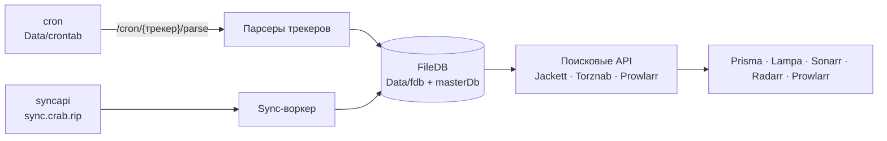

import Hero from '@site/src/components/Hero'

<Hero />

## Трекеры

<TrackerGrid />

## Возможности

| Возможность | Что это значит |
| --- | --- |
| **25 трекеров** | Rutracker, Kinozal, Rutor, NNM-Club, Megapeer, Bitru, Knaben, Toloka, Mazepa, LostFilm, Selezen, AnimeLayer, AniDub, AniStar, Anibelka, AniLiberty, AniFilm, LE-Production, ViruseProject, Korsars, Ultradox, BaibaKo, RuDub, SubsPlease, Torrent.by. См. [обзор трекеров](trackers/overview.mdx). |
| **Совместимые API** | Jackett JSON (`/api/v2.0/indexers/all/results`), Torznab XML (`/torznab/api`), Prowlarr (`/api/v1/indexer/1/newznab`, `/api/v1/search`) и собственный JSON API (`/api/v1.0/torrents`). |
| **FileDB** | Шардированное хранилище в `Data/fdb/` с индексом `masterDb` в памяти. Никаких PostgreSQL, SQLite или Redis. |
| **Поиск по ID** | IMDb (`tt…`), Кинопоиск (`kp…`), TMDB (`tmdb…` или ссылка themoviedb.org) превращаются в названия через Alloha TV API. |
| **Синхронизация** | Можно не парсить трекеры самому, а подтягивать готовую базу с сервера `https://sync.crab.rip` или другого инстанса. |
| **Веб-интерфейс** | Поиск (`/`) и статистика (`/stats`) для пользователей. |
| **Админ-панель** | Настройки с валидацией и diff, ручной запуск парсеров, фоновые задачи, обслуживание базы и логи - по закрытому адресу с токеном и паролем. См. [Админ-панель](admin.md). |
| **Документация API** | Интерактивный Swagger UI на `/swagger`, спецификация OpenAPI на `/openapi.yaml`. |
| **Обход Cloudflare** | FlareSolverr и cffetch для трекеров за Cloudflare, прокси HTTP/SOCKS, Tor для `.onion`. |
| **Горячая перезагрузка** | `init.yaml` перечитывается автоматически каждые 10 секунд, перезапуск не нужен. |

## Как это устроено

1. **Наполнение базы.** Внешний cron по расписанию из `Data/crontab` вызывает HTTP-эндпоинты `/cron/{трекер}/…`, парсеры скачивают страницы трекеров и записывают раздачи в FileDB. Либо встроенный sync-воркер забирает готовые данные с удалённого сервера.
2. **Хранение.** FileDB - gzip-JSON шарды в `Data/fdb/`, индекс ключей `masterDb` в памяти и на диске в `Data/masterDb.bz`.
3. **Поиск.** HTTP-сервер на порту `9117` принимает запросы клиентов и отвечает в нужном им формате.

Подробнее - в разделе [Архитектура](concepts/architecture.md).

## С чего начать

<Cards
  items={[
    { icon: '🚀', title: 'Быстрый старт', text: 'Запустить CrabIndex в Docker и сделать первый поиск за несколько минут.', to: '/quickstart/' },
    { icon: '📦', title: 'Установка', text: 'Установщик для Linux и systemd, Docker, сборка из исходников.', to: '/installation/' },
    { icon: '⚙️', title: 'Конфигурация', text: 'init.yaml: ключи, трекеры, прокси, FlareSolverr.', to: '/configuration/overview/' },
    { icon: '🦀', title: 'Трекеры', text: 'Каталог из 25 трекеров и способы авторизации.', to: '/trackers/overview/' },
    { icon: '🔌', title: 'Справочник API', text: 'Jackett, Torznab, Prowlarr и собственный JSON API.', to: '/api-reference/overview/' },
    { icon: '📺', title: 'Клиенты', text: 'Подключение Prisma, Lampa, Sonarr, Radarr, Prowlarr, AIOStreams.', to: '/clients/overview/' },
  ]}
/>

Исходный код: [github.com/sheinices/crabindex](https://github.com/sheinices/crabindex). Эта документация встроена в сервер и доступна по адресу `http://<host>:9117/docs/`.
